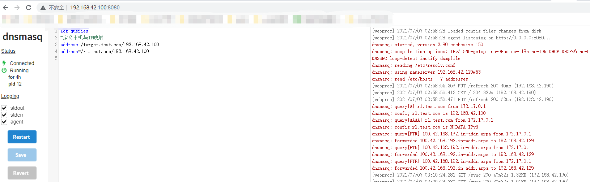
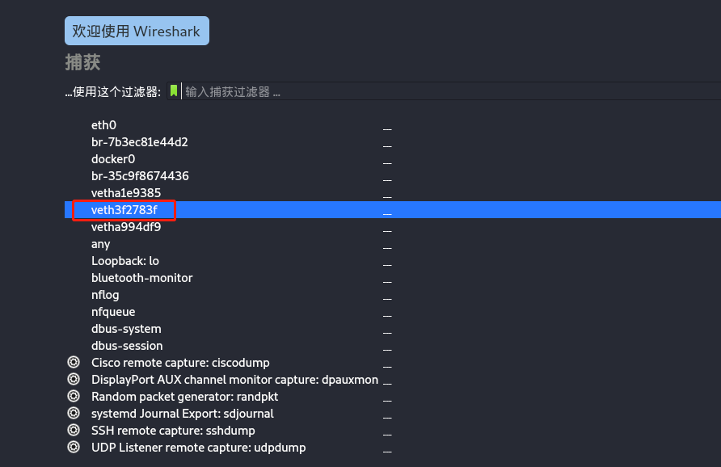
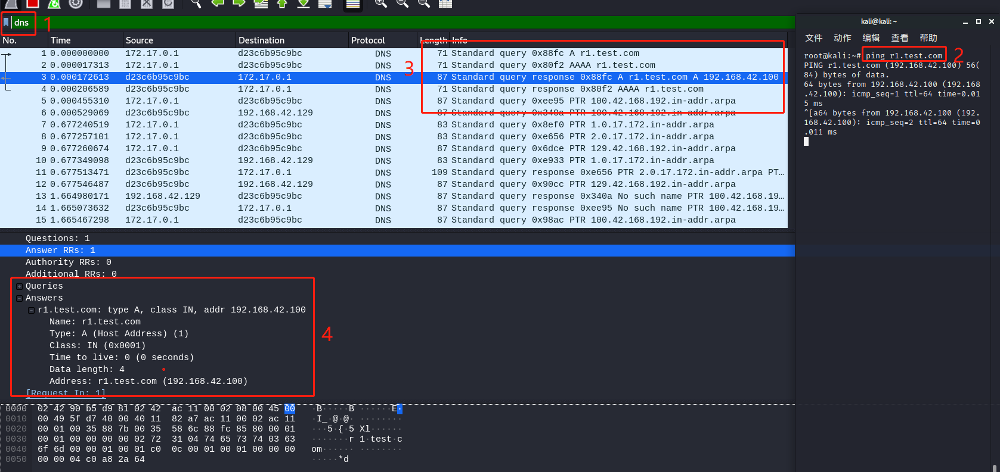

## 前言
在学习cobalt strike内容时，涉及到dns的内容比较多，于是做了抓取dns包的实验，在此记录下，以便以后查阅
## 实验环境
* 系统: kali 2020
* ip: 192.168.42.100
* 自建dns服务器: docker镜像jpillora/dnsmasq
* 抓包工具：kali中wireshark

## 具体步骤
#### 1. 在kali上搭建dns服务
```
root@kali:/home/kali/test# cat dnsmasq.conf
log-queries
#定义主机与IP映射
address=/target.test.com/192.168.42.100
address=/r1.test.com/192.168.42.100

root@kali:/home/kali/test#  docker run --name dnsmasq -d -p 53:53/udp -p 8080:8080 -v /home/kali/test/dnsmasq.conf:/etc/dnsmasq.conf --log-opt  "max-size=100m" -e "HTTP_USER=admin" -e "HTTP_PASS=admin" --restart always jpillora/dnsmasq
# 8080端口是dns服务的管理面板
```
以下是dns管理面板


#### 2. 为kali设置dns地址
```
root@kali:/home/kali/test# cat /etc/resolv.conf 
#nameserver 192.168.42.129  # 修改之前的配置
nameserver 127.0.0.1        # 新增
nameserver 192.168.42.100   # 新增
```
#### wireshark抓包
wireshark选取网卡时需要注意，要选择dns容器的对应网卡，那如何确定对应网卡呢？接着往下看
```commandline
root@kali:~# ip link  # 通过flink来查看对应关系
1: lo: <LOOPBACK,UP,LOWER_UP> mtu 65536 qdisc noqueue state UNKNOWN mode DEFAULT group default qlen 1000
    link/loopback 00:00:00:00:00:00 brd 00:00:00:00:00:00
2: eth0: <BROADCAST,MULTICAST,UP,LOWER_UP> mtu 1500 qdisc pfifo_fast state UP mode DEFAULT group default qlen 1000
    link/ether 00:0c:29:4d:06:dc brd ff:ff:ff:ff:ff:ff
...省略
4: docker0: <BROADCAST,MULTICAST,UP,LOWER_UP> mtu 1500 qdisc noqueue state UP mode DEFAULT group default 
    link/ether 02:42:90:b5:d9:81 brd ff:ff:ff:ff:ff:ff
...省略
9: veth3f2783f@if8: <BROADCAST,MULTICAST,UP,LOWER_UP> mtu 1500 qdisc noqueue master docker0 state UP mode DEFAULT group default 
    link/ether c2:34:5a:da:60:b4 brd ff:ff:ff:ff:ff:ff link-netnsid 0

root@kali:~# docker exec -it dnsmasq sh  # 进入容器
/ # cat /sys/class/net/eth0/iflink   
9
# 可以看出 veth3f2783f@if8就是dns容器对应的网卡
```
打开wireshark选择对应网卡进行流量抓取


流量分析

如图所示，步骤1是筛选只需要的dns协议数据，步骤2是制造dns数据，步骤3就是抓取到的dns流量，步骤4是具体数据包分析
在步骤4的Answers中是对步骤2中的请求回应结果，包括解析类型，长度，地址等。


